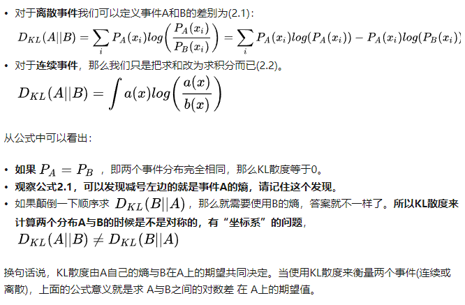
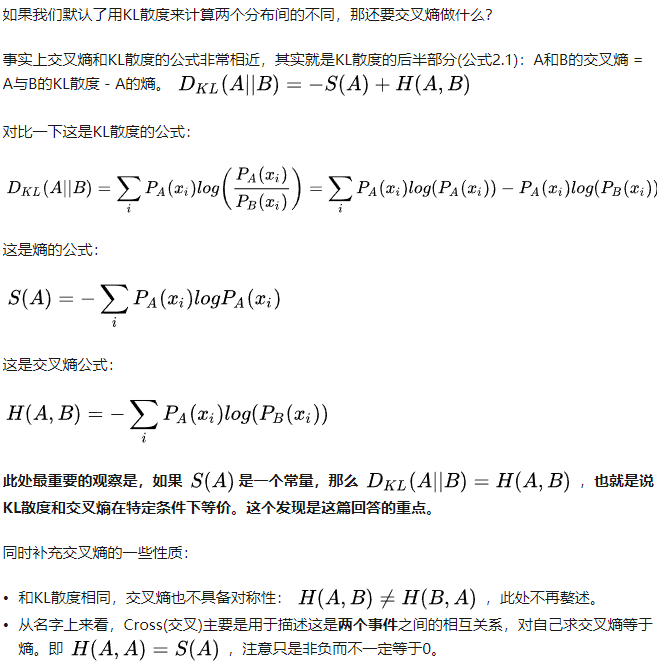
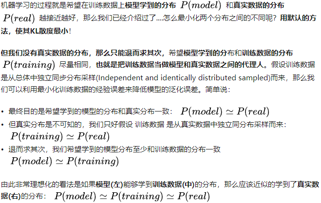
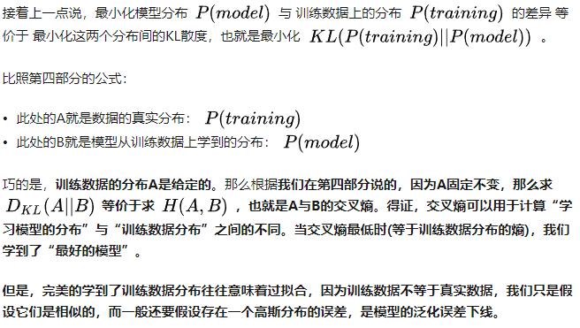

 熵被用于描述一个系统中的不确定性
-----
接地气但不严谨的表述：
+ 熵：表示一个事件A的自信息量，也就是A包含多少信息
+ KL散度：表示从事件A的角度来看，事件B有多大不同
+ 交叉熵： 表示从事件A的角度来看，如何描述事件B

总结：KL散度被用于计算代价，而在特定情况下最小化KL散度和最小化交叉熵等价。而交叉熵的运算更简单，所以用交叉熵来做代价。

#### 什么是熵
信息论中，熵是事件的信息量。

+ 越不可能发生的事件信息量越大
+ 独立事件的信息量可叠加

因此熵被定义为：
S(x) = -ΣP(x_i)*log(P(x_i))
一个一定会发生的事件，发生的概率是1，其熵为- 1 * log1 = 0,信息量为0

#### 如何衡量两个事件/分布之间的不同： KL散度
KL散度，又称为KL距离，用于计算两个分布之间的不同。但KL散度与欧氏距离不同，不具备对称性。

**KL散度的数学定义**

#### KL散度 = 交叉熵 - 熵？

#### 机器如何学习

#### 为什么交叉熵可以用作代价？

#### 总结
为了让学到的模型分布更加贴近真实分布，我们最小化【模型数据分布】与【训练数据分布】之间的KL散度，又因为训练数据的分布是固定的，因而最小化KL散度等价于最小化交叉熵。