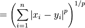
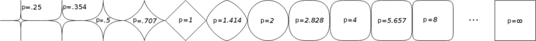

距离
---
1. 距离度量公理
设有两个变量 x,y， 要度量x,y之间的距离，需要定义一个距离函数d(x,y)
一般而言，d(x,y)需要满足以下几个准则：
>1) d(x,y) = 0 , iff x=y //与自己的距离为0
>2) d(x,y) >= 0  //距离大于等于0
>3) d(x,y) = d(y,x) //对称性
>4) d(x,k) + d(k,y) >= d(x,y) //两边之和大于第三边

### 欧氏距离度量
欧拉距离，来自于欧式几何，在数学上也可以称为范数。
#### 范数Norm
Lp范数就是x,y每个维度差距上取p次方加和后再开p次方根。
Lp范数又称*闵可夫斯基距离*

Lp  

p = 1: 曼哈顿距离 //就是英雄无敌里，英雄自身位置与一回合能走的最远距离

p = 2: 欧几里得距离 //就是英雄联盟里，丽桑卓大招中心距边缘的距离

p -> 正无穷:切比雪夫距离 //

闵可夫斯基距离随p值变化：

### 相似性
#### Jaccard Similarity
一般用于两个unary向量(buy or not, click or not)相似性的度量，或者用于集合相似度的定义
+ 集合的Jaccard Similarity
    
+ Unary向量的Jaccard Similarity
    
    
#### Cosine similarity

1.向量的內积可以用于观测两个向量的相似性。
A = [1/2, 1/2]^T;
B = [1/2, 1/2]^T;
C = [-1/2, 1/2]^T
inner<A, B> = 1/2
inner<A, C> = 0
2.向量的內积没有界限，例如inner<3\*A, 3\*B>=9\*inner<A, B>，可以除以长度以后再求內积，这就是应用十分广泛的***Cosine Similarity***

余弦相似度的思想在很多领域都有应用，例如表征文本相似度的(TF-IDF)、图片相似性的(Histogram)。TF-IDF中的IDF就是Log(文本数量/包含该词汇的文本数量),类似于除以了向量长度。
